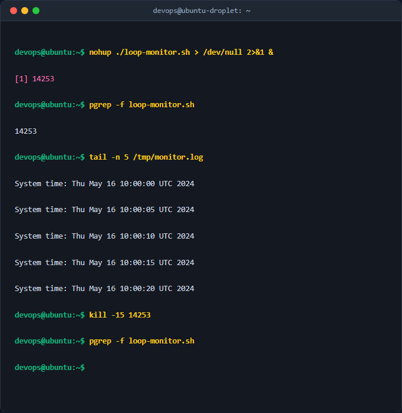

# Quản lý tiến trình nền với nohup và tín hiệu Kill

## 1. Mục tiêu & Bối cảnh kỹ thuật
- Nắm vững cách khởi chạy tiến trình chạy nền độc lập với phiên làm việc Terminal bằng lệnh `nohup` và ký tự `&`.
- Thành thạo công cụ giám sát hệ thống như `ps`, `pgrep`, `tail`.
- Hiểu rõ cơ chế và sử dụng thành thạo lệnh `kill` với các tín hiệu hệ thống (`SIGTERM` - 15 và `SIGKILL` - 9) để quản lý tiến trình an toàn.

## 2. Các bước thực hiện chi tiết
- **Bước 1**: Tạo kịch bản script `loop-monitor.sh` sử dụng vòng lặp vô hạn `while true` để ghi thời gian hiện tại vào `/tmp/monitor.log` mỗi 5 giây.
- **Bước 2**: Gán quyền thực thi cho script bằng lệnh `chmod +x loop-monitor.sh`.
- **Bước 3**: Khởi chạy script ở chế độ nền độc lập bằng lệnh `nohup ./loop-monitor.sh > /dev/null 2>&1 &` nhằm ngắt kết nối với SIGHUP và chuyển luồng xuất chuẩn.
- **Bước 4**: Tìm định danh tiến trình (PID) sử dụng lệnh `pgrep -f loop-monitor.sh`.
- **Bước 5**: Tắt tiến trình an toàn bằng tín hiệu `SIGTERM` (`kill -15 <PID>`), kiểm tra lại bằng `ps aux`, chuyển sang `SIGKILL` (`kill -9`) nếu tiến trình không phản hồi.

## 3. Kiểm tra & Xác thực kết quả

## 4. Kết luận & Best Practices bảo mật vận hành
- Luôn sử dụng `nohup` kết hợp chuyển hướng luồng `/dev/null 2>&1 &` khi chạy các tác vụ định kỳ dài hạn (daemon-like script) thủ công để tránh rò rỉ dung lượng ổ đĩa do log file phình to.
- Ưu tiên sử dụng tín hiệu `SIGTERM` (15) trước để tiến trình có cơ hội dọn dẹp tài nguyên (đóng kết nối database, giải phóng memory, flush buffer) trước khi dùng `SIGKILL` (9).